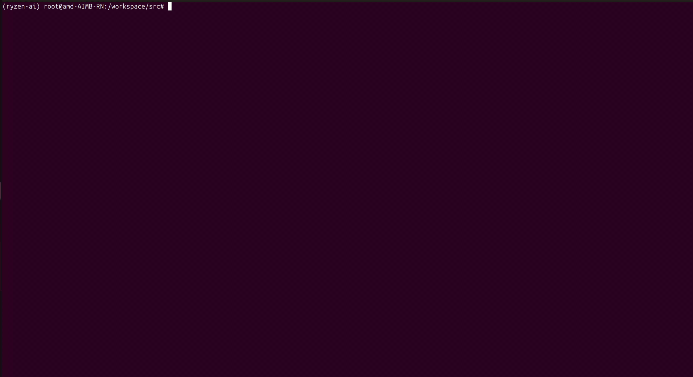

# AMD Ryzen™ AI NPU Docker Environment – Quick Start

This document describes how to install the AMD Ryzen AI NPU driver, start the Docker-based runtime environment, and verify that the NPU is working correctly.

The workflow is **driver → docker environment → container → venv → quicktest**.

---

## 1. Install the NPU Driver (Host)

On the host system, install the AMD XDNA / NPU driver:

```bash
./install_xdna.sh
```

This step installs:

* XDNA kernel driver
* Required firmware
* Host-side runtime dependencies


## 2. Detect Environment and Build Docker Setup

Run the build script on the host:

```bash
./build.sh
```

This script will:

* Check host prerequisites (Docker, XRT, runtime libraries)
* Pull the official Ryzen AI NPU Docker image
* Tag the image as `ryzen_ai_npu:latest`
* Start the container via **Docker Compose**

After completion, you should see messages indicating:

```text
Ryzen AI NPU container is running
NPU runtime environment is ready
```

Verify the container is up:

```bash
docker ps
```

You should see:

```text
ryzen-ai-npu
```

---

## 3. For X11 display support, run on host:
```bash
xhost +local:docker
```
---

## 4. Enter the Docker Container

Enter the running container using:

```bash
docker exec -it ryzen-ai-npu bash
```

You should now be inside the container shell, for example:

```bash
root@<host>:/workspace#
```

---

## 5. Activate the Python Virtual Environment

Inside the container, activate the Ryzen AI Python virtual environment:

```bash
source /home/ryzen_ai_1.6/venv/bin/activate
```

After activation, the shell prompt should change to:

```bash
(ryzen-ai) root@<host>:/workspace#
```

> Note:
> The virtual environment is **not activated automatically** when using `docker exec`.
> This is expected Docker behavior.

---

## 6. Run the NPU Verification Test

Run the built-in quick test to verify NPU functionality:

```bash
cd /home/ryzen_ai_1.6/venv/quicktest
python quicktest.py
```

If the setup is correct, you should observe:

* One or more subgraphs assigned to the NPU
* Final output similar to:

```text
Test Passed
```

This confirms that:

* The NPU kernel driver is working
* XRT is correctly visible inside the container
* The Ryzen AI runtime can execute workloads on the NPU

---

## 7. Run YOLO Object Detection on the NPU
After verifying the basic NPU functionality, you can run advanced applications like real-time object detection using YOLO models.
Ensure you are still inside the container and the virtual environment is activated (steps 3-4). Then navigate to the appropriate directory:

```bash
cd /workspace
```
Run the YOLO object detection script with NPU acceleration. By default, the script uses the NPU. To force the use of the CPU, add the --cpu-only parameter. For performance comparison between NPU and CPU, add the --compare-performance parameter. To run in headless mode (no GUI display), add the --no-display parameter.

```bash
python3 ./src/advantech-yolo.py \
  --model ./models/yolo11n.onnx \
  --video-file ./data/test.mp4 \
  --save-video \
  --output ./results/test_out.mp4 \
  --no-display
```

To force CPU usage:

```bash
python3 ./src/advantech-yolo.py \
  --model ./models/yolo11n.onnx \
  --video-file ./data/test.mp4 \
  --save-video \
  --output ./results/test_out.mp4 \
  --cpu-only \
  --no-display
```
For performance comparison:

```bash
python3 ./src/advantech-yolo.py \
  --model ./models/yolo11n.onnx \
  --video-file ./data/test.mp4 \
  --save-video \
  --output ./results/test_out.mp4 \
  --compare-performance \
  --no-display
```

Command Parameters Explained: 
Parameter	Description
| Option                     | Task                     | Input Size |
| :------------------------- | :----------------------- | :--------- |
| `--model ./models/yolo11n.onnx` | Object Detection         | 640×640    |
| `--video-file ./data/test.mp4`  | Video File Input         | N/A        |
| `--save-video`             | Save Output Video        | N/A        |
| `--output ./results/test_out.mp4` | Output Video Path        | N/A        |
| `--cpu-only`               | Force CPU Usage          | N/A        |
| `--compare-performance`    | Compare NPU and CPU      | N/A        |
| `--no-display`             | Run in Headless Mode     | N/A        |

---


---

## 8.Exporting Models

Convert models to optimized formats for deployment.

```bash
 python3 advantech-coe-model-export.py --model yolov.pt --output ./ --format onnx
```
The export utility guides you through three selections (Task, Size, Format).

**Task Selection:**

| Option | Task | Input Size |
|:-------|:-----|:-----------|
| 1 | Object Detection | 640×640 |
| 2 | Instance Segmentation | 640×640 |
| 3 | Classification | 224×224 |


---

### 9. Verify Installation (Optional)
 
Run the diagnostic script to confirm hardware acceleration is working.
 
```bash
./wise-bench.sh
```

The wise-bench script will run as below as per the system specifications.


---

## Notes & Troubleshooting

* If the test falls back to CPU execution:

  * Check that required Boost runtime libraries are installed
  * Ensure `/opt/xilinx/xrt` exists and is mounted into the container
* The Docker container **reuses host-installed XRT and firmware**
* Reboot the host after any NPU driver or firmware update

---

## Summary

1. Install NPU driver on the host
2. Run `build.sh` to prepare and start the Docker environment
3. Enter the container with `docker exec`
4. Activate the Python virtual environment
5. Run `quicktest.py` to verify NPU execution

You are now ready to run Ryzen AI workloads inside Docker using the NPU.

